<!-- ═══════════════════════════════════════════════════════════════════ README de perfil de Renan dos Santos Oliveira (@Renan0204) Repositório: github.com/Renan0204/Renan0204 HEADER ANIMADO: coloque o arquivo "header.svg" em /assets/header.svg no repositório. Ele é um SVG animado (terminal + átomo React + efeito de digitação). Não quer criar a pasta? Comente o bloco do header.svg e descomente a alternativa em capsule-render logo abaixo, funciona na hora, sem precisar de nenhum arquivo. ═══════════════════════════════════════════════════════════════════ --> 
  <!-- ALTERNATIVA SEM ARQUIVO (descomente esta linha e comente a de cima):  -->   

  

    <!-- Quiser adicionar WhatsApp? Descomente a linha abaixo. Só lembre que o número fica público e costuma atrair spam.  -->  

Sobre mim

Construo produtos web de ponta a ponta, da interface que o usuário vê até a automação que roda em segundo plano.

No dia a dia trabalho com React, TypeScript e Tailwind CSS criando aplicações, landing pages e sites institucionais. A parte que mais me interessa hoje é o que acontece depois que o site fica pronto: integrar sistemas, automatizar processos com n8n e aplicar IA para resolver gargalos reais de operação, formulário que dispara CRM, atendimento que se auto-organiza, tarefa manual que vira fluxo.

E porque interface boa precisa de fundação boa, sigo desenvolvendo o lado backend com Java, Spring Boot, APIs REST e PostgreSQL, com atenção a arquitetura em camadas, modelagem de dados e autenticação.

Meu objetivo é sempre o mesmo: entender por que a solução funciona, não só fazer funcionar.

 
<b>Como eu cheguei aqui</b>
  

Comecei aos 16 anos, num curso profissionalizante de informática. Foi um professor que me mostrou programação pela primeira vez, e ali ficou claro que era isso que eu queria fazer profissionalmente.

Hoje estou no 6º período de Sistemas para Internet (UniALFA, Umuarama/PR), com conclusão prevista para novembro de 2026, e já trabalho na área desde 2025, primeiro como freelancer, atualmente como Desenvolvedor Web CLT.

Idiomas: Português (nativo) · Inglês (básico a intermediário) · Espanhol (básico a intermediário)

 
No que eu atuo
<table> <tr> <td width="33%" valign="top" align="center"> <h3>Web & Interfaces</h3> 
 Aplicações web, landing pages e sites institucionais com foco em performance, responsividade e conversão.    <b>React</b> · <b>TypeScript</b> · <b>Tailwind CSS</b> · Vite · HTML5 · CSS3 
 </td> <td width="33%" valign="top" align="center"> <h3>IA & Automações</h3> 
 Fluxos automatizados e agentes de IA que eliminam trabalho manual e conectam ferramentas que não conversavam.    <b>n8n</b> · <b>OpenAI API</b> · Webhooks · Agentes de IA · Integrações 
 </td> <td width="33%" valign="top" align="center"> <h3>Backend & Dados</h3> 
 APIs REST em arquitetura de camadas, modelagem relacional e autenticação segura.    <b>Java</b> · <b>Spring Boot</b> · <b>PostgreSQL</b> · JPA/Hibernate · JWT 
 </td> </tr> </table> 
Tecnologias e ferramentas

Front-end

IA, Automações & Integrações

   

Back-end

     

Banco de dados

Ferramentas

 
   
 
<b>Detalhes da stack, o que eu já construí com cada uma</b>
  
Tecnologia	Como eu uso na prática
React + TypeScript	Aplicações web completas, componentes reutilizáveis, consumo de APIs e gerenciamento de estado
Tailwind CSS	Interfaces responsivas e design system consistente sem CSS espalhado
n8n	Automação de processos internos, integração entre CRM, formulários e plataformas de pagamento
OpenAI API / Agentes de IA	Automações inteligentes: triagem, geração de conteúdo e otimização de processos repetitivos
Java + Spring Boot	APIs REST com arquitetura em camadas (Controller / Service / Repository / Entity / DTO)
PostgreSQL / Supabase	Modelagem relacional, queries SQL, autenticação e persistência
JWT	Autenticação e controle de acesso por perfil de usuário
Docker	Containerização de ambientes e aplicações
Postman	Testes e documentação de endpoints

 
Projetos em destaque
<table> <tr> <td width="50%" valign="top"> <h3>Sistema de Gestão de Demandas</h3> 
<i>Aplicação web completa para organização e acompanhamento de demandas, com Kanban e automações de IA.</i>

<b>O que eu construí</b>

<ul> <li>Desenvolvimento full stack da aplicação</li> <li>Autenticação e controle de usuários</li> <li>Sistema Kanban para gestão visual das demandas</li> <li>Modelagem completa do banco de dados</li> <li>Integração com automações usando IA</li> <li>Interface e comunicação com APIs</li> </ul> 
      
 <!-- TODO: troque o "#" pelo link real do repositório -->

</td> <td width="50%" valign="top"> <h3>Sistema de Locação de Brinquedos (TCC)</h3> 
<i>E-commerce de locação de brinquedos. Sou o responsável pelo backend. <b>Em desenvolvimento.</b></i>

<b>O que eu construí</b>

<ul> <li>API REST com Spring Boot</li> <li>Arquitetura em camadas: Controller, Service, Repository, Entity e DTO</li> <li>Autenticação JWT</li> <li>Modelagem do banco de dados relacional</li> <li>Testes e documentação de endpoints no Postman</li> </ul> 
      
 <!-- TODO: troque o "#" pelo link real do repositório -->

</td> </tr> </table> 
Experiência prática

 <table> <tr> <td align="center" width="25%"> <h2>30+</h2> projetos web entregues </td> <td align="center" width="25%"> <h2>~26</h2> clientes atendidos </td> <td align="center" width="25%"> <h2>8+</h2> plataformas integradas </td> <td align="center" width="25%"> <h2>2025</h2> atuando na área </td> </tr> </table> 
  

Participo do ciclo completo: levantamento de requisitos → desenvolvimento → publicação → manutenção e evolução. Isso inclui conversar com o cliente, entender o problema antes de escrever código e dar suporte depois da entrega.

 
<b>Trajetória profissional</b>
  

Grupo Renda · Desenvolvedor Web · CLT · mai/2026 até hoje

Aplicações web, landing pages e sites institucionais com React, TypeScript e Tailwind CSS
Automações com n8n e agentes de IA para otimização de processos internos
Participação na entrega de mais de 30 projetos web para cerca de 26 clientes
Atuação do levantamento de requisitos até a entrega final

Desenvolvedor Web Freelancer · Projetos independentes · 2025 até hoje

Soluções web personalizadas para empresas e profissionais
Landing pages, sites institucionais e integrações sob demanda
Atendimento direto ao cliente, publicação e suporte pós-entrega

   

Integrações e plataformas que já conectei

        
 
GitHub em números
<!-- O card de estatísticas roda numa instância própria na Vercel
  (github-readme-stats-nine-ashy-18). Detalhes em SETUP-VERCEL.md. -->

     

  

   
 <!-- A cobrinha só aparece depois que você criar o workflow. Instruções no arquivo .github/workflows/snake.yml que veio junto. --> <picture> <source media="(prefers-color-scheme: dark)" srcset="https://raw.githubusercontent.com/Renan0204/Renan0204/output/snake-dark.svg"/> <source media="(prefers-color-scheme: light)" srcset="https://raw.githubusercontent.com/Renan0204/Renan0204/output/snake.svg"/>  </picture> 
 
Vamos conversar?

Tenho interesse em oportunidades como Desenvolvedor Web / Front-end, em projetos de automação e IA aplicada e em posições Full Stack que envolvam APIs e integrações.

Se você tem um processo manual que deveria ser automático, ou uma interface que precisa sair do Figma, me chama.

    

  

  

    
